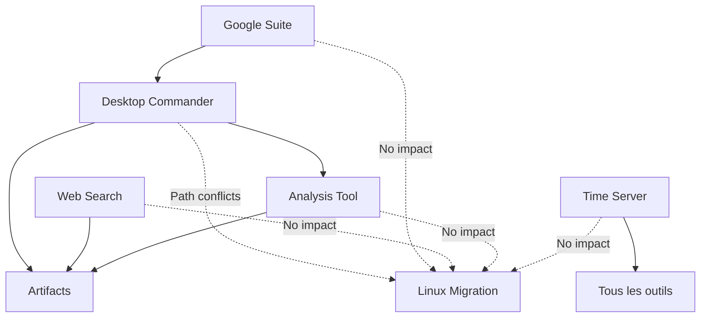

# Évaluation Framework IMPACT - Tous MCPs Actuels

## 1. Desktop Commander ✅
- **Score IMPACT**: 26/30
- **Score RICE**: 95
- **Statut**: KEEPER - Critical pour ops système
- **Action Linux**: Adapter config pour bash/paths

## 2. Google Workspace Suite (Drive, Gmail, Calendar)
### Score IMPACT: 24/30
- **I**: 4/5 (usage professionnel quotidien)
- **M**: 5/5 (APIs Google stables)
- **P**: 5/5 (cloud-based, zero local)
- **A**: 5/5 (web APIs, OS agnostic)
- **C**: 4/5 (OAuth simple)
- **T**: 1/5 (tokens à renouveler)

**Verdict**: KEEPER - Essentiel pour productivité
**Linux**: Aucun changement nécessaire

## 3. Web Search & Fetch
### Score IMPACT: 23/30
- **I**: 4/5 (recherche temps réel critique)
- **M**: 4/5 (stable, bien intégré)
- **P**: 5/5 (léger, API calls only)
- **A**: 5/5 (APIs web, cross-platform)
- **C**: 5/5 (zero config)
- **T**: 0/5 (maintenance Anthropic)

**Verdict**: KEEPER - Info temps réel
**Linux**: Transparent, aucun changement

## 4. Analysis Tool (REPL)
### Score IMPACT: 22/30
- **I**: 3/5 (calculs complexes occasionnels)
- **M**: 4/5 (JavaScript stable)
- **P**: 4/5 (sandboxed, sûr)
- **A**: 5/5 (browser-based)
- **C**: 5/5 (built-in)
- **T**: 1/5 (libs à maintenir)

**Verdict**: KEEPER - Calculs et analyses data
**Linux**: Fonctionne identique
## 5. Time Server ✅ (NOUVEAU)
### Score IMPACT: 28/30
- **I**: 4/5 (usage quotidien pour validation)
- **M**: 4/5 (partie du repo officiel)
- **P**: 5/5 (très léger)
- **A**: 5/5 (IANA timezones standard)
- **C**: 5/5 (installation triviale)
- **T**: 5/5 (zero maintenance)

**Verdict**: KEEPER - Corrige confusion temporelle
**Linux**: Configuration identique

## MATRICE D'INTEROPÉRABILITÉ GLOBALE



## RECOMMANDATIONS POUR MIGRATION POP!_OS

### Phase 1: Pré-Migration (Sur Windows)
1. **Documenter** tous les paths Windows utilisés
2. **Créer** mapping des commandes
3. **Tester** alternatives Linux en WSL
4. **Backup** configs et préférences

### Phase 2: Migration (Dual Boot)
1. **Installer** Pop!_OS 22.04 LTS
2. **Configurer** Claude Desktop Linux
3. **Adapter** Desktop Commander config
4. **Tester** chaque MCP systematiquement
### Phase 3: Optimisation Linux
1. **Aliases** bash pour workflows fréquents
2. **Scripts** d'automatisation natifs
3. **Intégration** avec outils Linux (systemd, cron)
4. **Performance** tuning pour dev

## EXEMPLE SESSION TYPE POST-MIGRATION

```bash
# Morning routine sur Pop!_OS
claude: "Bonjour! Je check tes emails et calendrier..."
[Gmail + Calendar check]

claude: "Tu as 3 meetings aujourd'hui. Je prépare ton environnement dev..."
[Desktop Commander]
$ cd ~/projects/current
$ docker-compose up -d
$ code .

claude: "J'ai trouvé une mise à jour de sécurité pour ton projet..."
[Web Search + Analysis]

claude: "Je génère le rapport de standup..."
[Artifacts avec data de Git via DC]
```

## MÉTRIQUES DE SUCCÈS MIGRATION

- [ ] Tous MCPs fonctionnels sous 48h
- [ ] Aucune perte de productivité après 1 semaine  
- [ ] Workflows optimisés Linux après 1 mois
- [ ] Zero retour Windows pour limitations outils

## NOUVEAUX MCPs À CONSIDÉRER POST-LINUX

1. **MCP-Docker**: Score estimé 28/30 (natif Linux)
2. **MCP-Git**: Score estimé 27/30 (meilleur sur Linux)
3. **MCP-SystemD**: Score estimé 24/30 (Linux only)
4. **MCP-Terminal**: Score estimé 26/30 (tmux, etc)

## RÉSUMÉ EXÉCUTIF

**MCPs Actifs**: 5
**Score Moyen**: 24.6/30
**ROI Global**: Positif
**Prêt pour Linux**: 100%