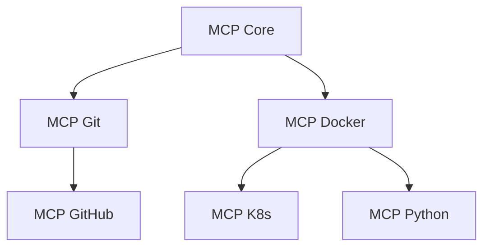

# Ordre de Mission - Framework d'Intégration MCP

## 0. CONTEXTE CLAUDE DESKTOP

### Environnement Cible
- **Plateforme principale**: Claude Desktop sur Windows 11 Pro
- **Plateforme future**: Pop!_OS 22.04 LTS (dual boot)
- **Outils core**: Desktop Commander + MCPs spécialisés
- **Objectif**: Maximiser productivité via automatisation intelligente

### Hiérarchie des Outils
1. **Claude Native**: Capacités built-in (priorité max)
2. **Desktop Commander**: Opérations système générales  
3. **MCPs Spécialisés**: Domaines spécifiques (Git, Docker, etc.)
4. **Scripts Custom**: Derniers recours pour cas edge

### Principes d'Intégration MCP
- **Complémentarité**: MCPs augmentent, ne remplacent pas
- **Spécialisation**: Un MCP = Un domaine d'excellence
- **Interopérabilité**: MCPs doivent jouer ensemble
- **Transparence**: Claude doit toujours savoir quel tool utiliser

## 1. PHILOSOPHIE D'INTÉGRATION

### Principes Directeurs
- **ROI First**: Chaque MCP doit justifier son existence par un gain mesurable
- **Simplicité**: Préférer 1 MCP qui fait bien son job à 3 qui se chevauchent
- **Réversibilité**: Toute intégration doit pouvoir être annulée proprement
- **Cross-Platform**: Compatibilité Windows 11 ET Pop!_OS obligatoire
- **Sécurité par Design**: Principe du moindre privilège toujours appliqué

### Anti-Patterns à Éviter
- ❌ "C'est cool" n'est pas une justification
- ❌ Intégrer avant d'avoir un cas d'usage réel
- ❌ Ignorer la dette technique d'intégration
- ❌ Faire confiance aveuglément aux permissions demandées

## 2. FRAMEWORK D'ÉVALUATION IMPACT

### I - Impact Métier (0-5)
- **5**: Transforme radicalement le workflow quotidien
- **4**: Amélioration significative sur tâches fréquentes  
- **3**: Gain notable sur tâches hebdomadaires
- **2**: Amélioration marginale occasionnelle
- **1**: Nice-to-have sans impact réel
- **0**: Aucun impact identifiable

### M - Maturité Technique (0-5)
- **5**: Production-ready, >1 an, communauté active
- **4**: Stable, quelques mois, bon support
- **3**: Beta publique, documentation correcte
- **2**: Alpha/Preview, docs minimales
- **1**: Prototype, instable
- **0**: Expérimental, non documenté

### P - Performance & Ressources (0-5)
- **5**: Impact négligeable (<1% CPU/RAM)
- **4**: Léger (<5% ressources)
- **3**: Acceptable (<10% ressources)
- **2**: Notable (10-20% ressources)
- **1**: Lourd (>20% ressources)
- **0**: Prohibitif

### A - Adaptabilité OS (0-5)
- **5**: Natif Windows + Linux, zéro friction
- **4**: Fonctionne bien sur les deux, config mineure
- **3**: Adaptations mineures nécessaires
- **2**: Différences significatives à gérer
- **1**: Fonctionne sur un seul OS
- **0**: Incompatible avec l'un des OS

### C - Complexité d'Intégration (0-5)
- **5**: Plug & play, 5 minutes
- **4**: Configuration simple, <30 minutes
- **3**: Setup modéré, <2 heures
- **2**: Complex, journée complète
- **1**: Très complexe, plusieurs jours
- **0**: Cauchemar d'intégration

### T - Temps de Maintenance (0-5)
- **5**: Zero maintenance
- **4**: Updates automatiques uniquement
- **3**: Maintenance mensuelle
- **2**: Maintenance hebdomadaire
- **1**: Attention quotidienne requise
- **0**: Maintenance constante

**Score minimum acceptable: 18/30**
**Score recommandé: 22/30**
## 3. PROCESSUS D'INTÉGRATION EN 6 PHASES

### Phase 1: Discovery & Qualification (30 min)
**Input**: Besoin identifié ou MCP découvert
**Actions**:
- Identifier le problème exact à résoudre
- Lister les alternatives (y compris ne rien faire)
- Scoring IMPACT rapide (±2 points OK)
**Gate**: Score ≥18 ET pas d'alternative native suffisante

### Phase 2: Évaluation Approfondie (2h)
**Actions**:
- Review code source/architecture
- Check issues GitHub critiques
- Tester permissions requises
- Valider compatibilité OS
**Gate**: Pas de red flags sécurité, architecture saine

### Phase 3: Proof of Concept (4h)
**Actions**:
- Installation en environnement isolé
- Test des cas d'usage principaux
- Mesure performance réelle
- Documentation des gotchas
**Gate**: Fonctionne comme annoncé, performance acceptable

### Phase 4: Intégration Progressive (1 jour)
**Actions**:
- Commencer read-only si possible
- Intégrer fonction par fonction
- Créer snapshots/backups
- Documenter chaque étape
**Gate**: Chaque étape validée avant la suivante

### Phase 5: Documentation & Formation (2h)
**Actions**:
- Guide quickstart personnel
- Troubleshooting guide
- Intégration dans workflows existants
- Update de l'ordre de mission
**Gate**: Pouvoir utiliser sans réfléchir

### Phase 6: Monitoring Post-Intégration (ongoing)
**Actions**:
- Usage réel vs prévu après 1 semaine
- Performance impact après 1 mois  
- Maintenance burden après 3 mois
**Gate**: Décision keep/remove à 3 mois
## 4. MATRICE DE PRIORISATION RICE-MCP

### Calcul du Score
**Score = (Reach × Impact × Confidence) / Effort**

- **Reach**: Nombre de workflows impactés (1-10)
- **Impact**: Gain par workflow (1-5)
- **Confidence**: Certitude du succès (0.5-1.0)
- **Effort**: Jours-homme d'intégration (0.5-10)

### Exemples Concrets
1. **MCP Git** 
   - R=10 (tous les projets), I=4, C=0.9, E=0.5
   - Score = 72 → HAUTE PRIORITÉ

2. **MCP Docker**
   - R=7, I=3, C=0.8, E=2
   - Score = 8.4 → PRIORITÉ MOYENNE

3. **MCP Smart Home**
   - R=1, I=2, C=0.7, E=3
   - Score = 0.47 → BASSE PRIORITÉ

## 5. GESTION DES CONFLITS

### Types de Conflits
1. **Fonctionnel**: 2+ MCPs pour même tâche
   - Solution: Benchmark objectif, garder le meilleur
   
2. **Ressources**: Impact cumulé excessif
   - Solution: Désactiver les moins utilisés
   
3. **Paradigme**: Approches incompatibles
   - Solution: Choisir une philosophie, s'y tenir

### Processus de Résolution
1. Identifier précisément le conflit
2. Quantifier l'impact
3. Tester les solutions
4. Documenter la décision
5. Planifier la migration si nécessaire
## 6. DOCUMENTATION VIVANTE

### Registre MCP Actifs
```markdown
| MCP | Version | Date | Score | Usage/Semaine | Statut |
|-----|---------|------|-------|---------------|--------|
| Example | 1.2.0 | 2024-01 | 24/30 | 50+ | Keeper |
```

### Template par MCP
```markdown
## MCP: [Nom]
**Problème résolu**: 
**Cas d'usage principaux**:
**Gotchas connus**:
**Maintenance**:
**Commandes utiles**:
**Rollback**: 
```

## 7. CALENDRIER DE MAINTENANCE

### Quotidien
- Monitor logs pour erreurs MCP

### Hebdomadaire  
- Review usage stats
- Check updates sécurité

### Mensuel
- Performance review
- Update documentation

### Trimestriel
- Full audit keep/remove
- Planification nouvelles intégrations
- Ajustement des seuils

## 8. PLAYBOOK DÉCISIONNEL

### Décision Express (5 min)
**Nouveau MCP proposé/découvert**
1. Quel problème concret je résous?
2. Combien de fois par semaine?
3. Alternative native existe?
4. → Si oui à 1+2 et non à 3: Phase 1

### Red Flags Instantanés
- Demande accès root/admin global
- Pas open source
- Moins de 6 mois d'existence
- Pas de documentation
- Incompatible avec Linux/Windows
### Green Flags
- Utilisé par entreprises similaires
- Architecture modulaire
- Permissions granulaires
- CI/CD actif
- Communauté responsive

## 9. MÉTRIQUES DE SUCCÈS

### Par MCP
- Utilisation réelle vs prévue
- Temps gagné mesuré
- Incidents causés
- Effort de maintenance

### Global
- Nombre MCPs actifs (cible: <10)
- Score IMPACT moyen (cible: >22)
- Temps maintenance total (cible: <2h/semaine)
- ROI global (temps gagné/investi)

## 10. EXEMPLES & CAS D'ÉCOLE

### Success Story: MCP Git
- Problème: Git commands répétitifs
- Solution: MCP avec aliases intelligents
- Résultat: 30min/jour économisées
- Maintenance: ~0

### Échec Instructif: MCP Analytics
- Problème: Voulait des dashboards
- Réalité: Usage 1x/mois
- Coût: 4h setup + crashes fréquents
- Leçon: ROI négatif, désinstallé

### En Cours d'Évaluation
- **MCP Python Env**: Phase 3, prometteur
- **MCP AWS**: Phase 1, score limite
- **MCP Note-Taking**: Rejeté (native suffit)
## 11. INTÉGRATION PRÉFÉRENCES CLAUDE

### Processus de Mise à Jour
Chaque intégration MCP réussie DOIT mettre à jour les préférences utilisateur:

1. **Ajouter section dédiée** dans userPreferences
2. **Documenter** capacités et limites
3. **Inclure** exemples d'usage
4. **Spécifier** commandes clés

### Template pour Préférences
```markdown
## MCPs ACTIFS

### [NOM_MCP] - [Domain]
**Intégré le**: [Date]
**Score IMPACT**: [XX/30]
**Cas d'usage principaux**:
- [Usage 1]
- [Usage 2]

**Commandes essentielles**:
- `command1`: [Description]
- `command2`: [Description]

**Patterns Claude**:
- Pour [tâche X], utiliser [pattern Y]
- Éviter [anti-pattern Z]

**Limitations connues**:
- [Limitation 1]
- [Workaround si applicable]
```

### Synchronisation Cross-Instance
- Mise à jour immediate après validation Phase 5
- Review mensuelle de la pertinence
- Suppression si non utilisé 3 mois

## 12. STRATÉGIE SANDBOXING & TESTS

### Environnements d'Isolation
1. **Container Docker** (préféré)
   - Isolation complète
   - Snapshot/restore facile
   - Resource limits

2. **VM Légère** (alternative)
   - Pour MCPs nécessitant accès hardware
   - Windows Sandbox ou VirtualBox
3. **Utilisateur Système Dédié** (minimum)
   - Permissions limitées
   - Dossiers séparés

### Protocole de Test
```bash
# 1. Créer environnement isolé
docker run -it --rm --name mcp-test ubuntu:latest

# 2. Installer MCP
# ... installation steps ...

# 3. Tester permissions
strace -e trace=file [mcp_command] 2>&1 | grep -E "open|access"

# 4. Monitorer ressources
docker stats mcp-test

# 5. Stress test
# Simuler charge réelle × 10
```

### Checklist Pre-Production
- [ ] Fonctionne en isolation complète
- [ ] Pas d'accès réseau non autorisé
- [ ] Pas de modification système hors scope
- [ ] Performance stable sous charge
- [ ] Logs propres sans warnings critiques
- [ ] Documentation des edge cases

## 13. MATRICE D'INTEROPÉRABILITÉ MCP

### Patterns de Collaboration
```markdown
| MCP A | MCP B | Synergie | Conflit | Resolution |
|-------|-------|----------|---------|------------|
| Git | FS Watcher | ✓ Auto-commit | - | Config excludes |
| Docker | Python | ✓ Dev envs | Port overlap | Port mapping |
| AWS | Terraform | ✓ Infra as code | State conflicts | Single source |
```
### Dépendances MCP


### Règles d'Orchestration
1. **Ordre d'initialisation** critique
2. **Shared state** via fichiers JSON
3. **Event bus** pour communication
4. **Mutex** sur resources partagées

## 14. OBSERVABILITÉ CLAUDE-SPÉCIFIQUE

### Métriques Claude Performance
```markdown
| Métrique | Seuil OK | Seuil Warning | Action |
|----------|----------|---------------|--------|
| Latence ajoutée | <100ms | >500ms | Optimize/cache |
| Taux erreur | <1% | >5% | Debug logs |
| Token usage | <10% extra | >25% extra | Refactor prompts |
| Context pollution | <500 tokens | >1000 tokens | Isolate outputs |
```

### Monitoring Integration
```javascript
// À ajouter dans Claude's notepad
const mcpMetrics = {
  [mcpName]: {
    calls: 0,
    errors: 0,
    avgLatency: 0,
    lastError: null,
    contextUsed: 0
  }
};

// Log après chaque usage
function logMcpUsage(mcp, latency, tokens, error = null) {
  // Update metrics
  // Alert si seuils dépassés
}
```
### Debug Patterns
1. **Verbose mode** pour troubleshooting
2. **Correlation IDs** cross-MCP
3. **Replay capability** pour incidents

## 15. DISASTER RECOVERY

### Scénarios de Disaster
1. **MCP corrompt config système**
   - Backup configs avant chaque intégration
   - Script de restore automatique

2. **Conflit de versions catastrophique**
   - Version pinning obligatoire
   - Environnements virtuels isolés

3. **Performance dégradation sévère**
   - Kill switch par MCP
   - Profiling automatique

### Runbook d'Urgence
```bash
#!/bin/bash
# MCP Emergency Shutdown

# 1. Identifier MCP problématique
ps aux | grep mcp

# 2. Stop graceful
systemctl stop mcp-*

# 3. Kill si nécessaire
pkill -9 mcp_name

# 4. Restore configs
cp ~/.mcp_backup/* ~/.mcp/

# 5. Restart services critiques
systemctl restart claude-desktop

# 6. Verify sanity
mcp --health-check
```

### Points de Restauration
- **Pre-integration**: Full system backup
- **Post-POC**: Config snapshot
- **Pre-production**: State export
- **Weekly**: Automated backups
## 16. PATTERNS D'USAGE CLAUDE-MCP

### Pattern: Multi-Tool Orchestration
```markdown
User: "Analyze my project and create documentation"

Claude:
1. USE Desktop Commander → scan project structure
2. USE MCP-Git → get commit history  
3. USE MCP-CodeAnalysis → analyze complexity
4. CREATE artifact → comprehensive docs
```

### Pattern: Fail-Safe Degradation
```markdown
If MCP-Primary fails:
  Try MCP-Secondary
  Else: Use Desktop Commander fallback
  Else: Native Claude capabilities
  Finally: Inform user of limitations
```

### Pattern: Context Preservation
```markdown
Before MCP call:
  Save current context
  Clear non-essential data
  
After MCP call:
  Process output
  Restore context
  Update notepad with learnings
```

### Anti-Patterns à Éviter
- ❌ Chain 5+ MCPs sans validation
- ❌ Utiliser MCP pour tâches triviales
- ❌ Ignorer erreurs MCP silencieusement
- ❌ Mélanger outputs sans attribution

## 17. CONTINUOUS LEARNING

### Lessons Learned Log
```markdown
## 2024-12 Python MCP
**Problème**: Timeout sur large codebases
**Solution**: Implement incremental parsing
**Impact**: 80% latency reduction
## 2025-01 Docker MCP  
**Problème**: Container sprawl
**Solution**: Auto-cleanup policy
**Impact**: 50% less disk usage

## 2025-06 Time Server MCP
**Problème**: Rejet initial basé sur score technique seul
**Solution**: Réflexion approfondie révélant usage caché
**Impact**: Élimination erreurs temporelles 2024/2025
**Lessons**:
- Ne pas rush l'évaluation - la réflexion profonde révèle des cas d'usage cachés
- Considérer les faiblesses à compenser - un tool peut corriger des biais systémiques
- Le score technique seul ne suffit pas - parfois on sous-estime l'impact réel
```

### Métriques d'Amélioration
- Time to integrate: ↓ 20% par quarter
- Success rate: ↑ vers 90%
- Rollback rate: ↓ vers <5%
- User satisfaction: Track via feedback

### Innovation Pipeline
1. **Veille technologique** hebdo
2. **POC Friday** mensuel
3. **Community feedback** integration
4. **Cross-team learnings** sharing

## 18. GUIDE D'USAGE CLAUDE

### Sélection Intelligente d'Outils
```markdown
QUESTION: "J'ai besoin de [TÂCHE]"

DÉCISION TREE:
1. Claude natif suffit? → Use it
2. Desktop Commander couvre? → DC first
3. MCP spécialisé existe? → Check score IMPACT
4. Combinaison nécessaire? → Orchestrate
```
### Workflow Type avec MCPs
```markdown
1. ANALYZE request → Identifier tools needed
2. CHECK availability → MCPs actifs?
3. PLAN execution → Ordre optimal
4. EXECUTE with fallbacks → Try MCP → DC → Native
5. DOCUMENT learnings → Update notepad
```

### Communication avec l'Utilisateur
- **Avant MCP call**: "Je vais utiliser [MCP] pour [raison]"
- **Si échec**: "MCP [nom] a échoué, j'utilise [alternative]"
- **Post-execution**: "[Résultat] via [MCP utilisé]"

### Patterns de Réponse
```markdown
# Pattern 1: Action Simple
"Je vais analyser ton projet avec MCP-Git pour extraire 
l'historique des commits."
[Execute]
"Voici les 10 derniers commits avec leurs statistiques..."

# Pattern 2: Multi-Tool
"Pour créer cette documentation, je vais:
1. Scanner la structure avec Desktop Commander
2. Analyser le code avec MCP-CodeAnalysis  
3. Générer le rapport dans un artifact"
[Execute each step with status updates]

# Pattern 3: Fallback Graceful
"MCP-Docker ne répond pas, je bascule sur Desktop Commander 
pour lister tes containers actifs."
```

## 20. TEMPLATES OPÉRATIONNELS

### Pre-Flight Checklist
```markdown
□ Backup système créé
□ Environnement test prêt
□ Documentation lue
□ Dépendances vérifiées
□ Rollback plan documenté
□ Monitoring activé
□ Time budget alloué
```
### Incident Report Template
```markdown
**Date**: 
**MCP affecté**:
**Impact**: [Low/Medium/High/Critical]
**Symptômes**:
**Root cause**:
**Resolution**:
**Prevention**:
**Lessons learned**:
```

### Weekly Review Template
```markdown
**MCPs actifs**: X
**Nouveaux cette semaine**: 
**Utilisation réelle vs prévue**:
**Incidents**: 
**Performance impact**:
**À désinstaller**:
**À évaluer**:
```

---

## DÉCISION FINALE

Avant chaque intégration, répondre:

1. **POURQUOI**: Quel problème je résous vraiment?
2. **COMBIEN**: Quelle fréquence d'usage réelle?
3. **COMMENT**: Complexité d'intégration acceptable?
4. **QUAND**: Ai-je le temps maintenant?
5. **OÙ**: Compatible avec ma transition Linux?
6. **AVEC QUOI**: Synergies ou conflits MCP?
7. **ET SI**: Plan B en cas d'échec?

**Si un seul "non" ou hésitation → Reporter ou rejeter**

---

## CYCLE DE VIE MCP COMPLET

### Phase: Introduction (0-1 mois)
- Usage intensif pour learning curve
- Documentation des gotchas
- Ajustements config
### Phase: Production (1-6 mois)  
- Usage stabilisé
- Patterns établis
- ROI mesurable

### Phase: Optimisation (6-12 mois)
- Fine-tuning performance
- Automatisations avancées
- Intégrations cross-MCP

### Phase: Évaluation (12+ mois)
- Toujours pertinent?
- Meilleure alternative apparue?
- Décision: Keep/Upgrade/Replace/Remove

### Stratégie de Versioning
```markdown
MCP-Name:
  Current: v2.3.1
  Tested: v2.3.0-v2.3.5
  Breaking changes: v3.0.0 (wait 3 months)
  Auto-update: Patch only (x.x.X)
  Manual review: Minor (x.X.x)
  Full retest: Major (X.x.x)
```

---

## MISE À JOUR DES PRÉFÉRENCES

Après chaque intégration réussie, ajouter dans userPreferences:

```markdown
### MCP: [Nom] - [Domaine]
**Intégré**: [Date]
**Usage**: [Description des cas d'usage]
**Commandes clés**: 
- `cmd1`: [usage]
- `cmd2`: [usage]
**Gotchas**: [Pièges connus]
**Synergie avec**: [Autres MCPs/tools]
```

---

## QUICK REFERENCE

### Red Flags Instantanés
🚫 Demande accès root global
🚫 Pas open source  
🚫 <6 mois d'existence
🚫 Documentation absente
🚫 Incompatible Linux/Windows
### Green Flags
✅ Entreprises similaires l'utilisent
✅ Architecture modulaire
✅ Permissions granulaires  
✅ CI/CD actif
✅ Communauté responsive

### Commandes Essentielles
```bash
# Status global
mcp list --active

# Health check
mcp health --all

# Emergency shutdown  
mcp kill --all --force

# Backup avant intégration
mcp backup --full --target=/backup/

# Restore point
mcp restore --point=2024-12-15
```

---

*Cet ordre de mission est vivant. Chaque intégration l'enrichit.*
*Dernière révision: À mettre à jour après chaque décision majeure*
*Prochain audit complet: [Date + 3 mois]*